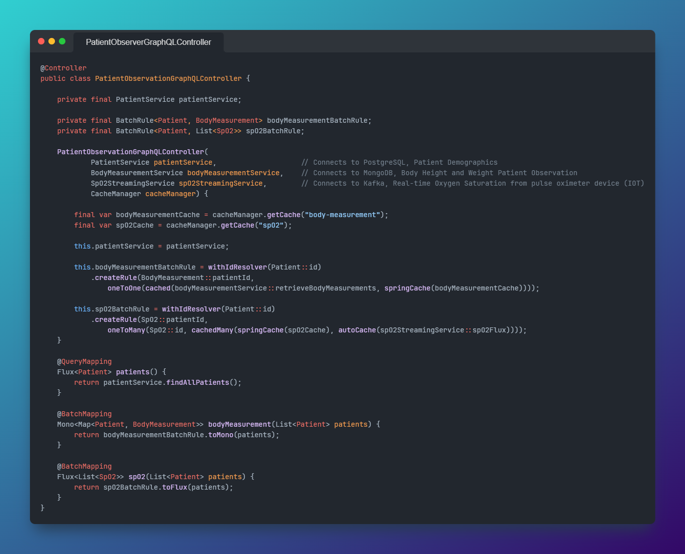
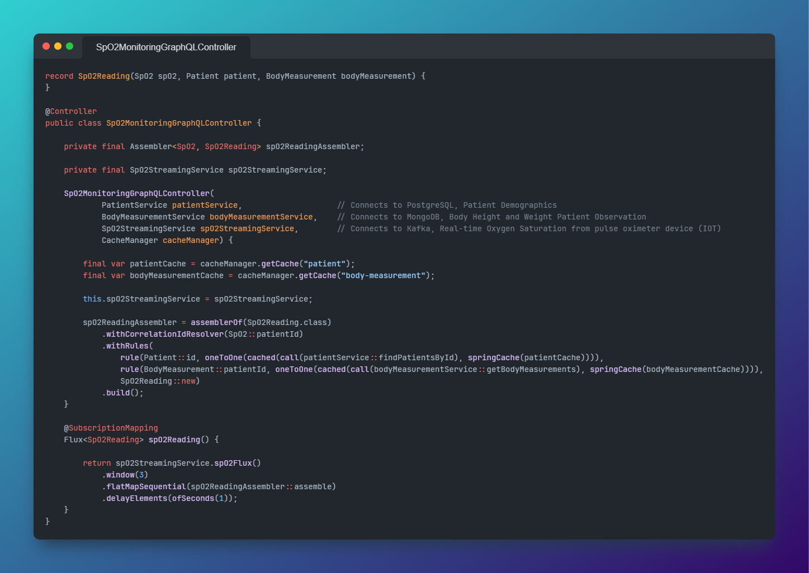

# Assembler and Spring WebFlux/GraphQL Example

This repository showcases the standalone usage of [Assembler](https://github.com/pellse/assembler) + the integration of [Assembler](https://github.com/pellse/assembler) with [Spring WebFlux](https://docs.spring.io/spring-framework/reference/web-reactive.html) and [Spring GraphQL](https://spring.io/projects/spring-graphql) to aggregate data from multiple sources in a single query. This combination serves as a powerful tool for implementing API composition, facilitating efficient data retrieval while reducing the complexity of client-side data aggregation.

## Scenario
This example demonstrates a basic healthcare application for simulating monitoring patient data. Three services are implemented: the Patient Service for retrieving patient demographics from PostgreSQL, the Blood Pressure Service for retrieving patient's systolic and diastolic blood pressures from MongoDB, and the Heart Rate Streaming Service for real-time heart rate monitoring from a ECG device via Kafka. A GraphQL Controller is implemented in `PatientObservationController` to aggregate data from these services.

*This sample app was deliberately kept simple to showcase the Assembler integration with Spring WebFlux and Spring GraphQL in a very accessible way. However, it does not incorporate more advanced concepts such as Change Data Capture (CDC) or complex stream processing*

## Assembler with Spring WebFlux/GraphQL for API Composition and solving the N+1 Query Problem

### Batch Mapping (Data Querying)
The new `BatchRule` API from Assembler seamlessly integrates with the Spring GraphQL [@BatchMapping](https://docs.spring.io/spring-graphql/docs/current/reference/html/#controllers.batch-mapping) mechanism, as shown in the usage example found in `PatientObservationController`. Additionally, this example showcases additional features of Assembler, including:
- caching of service invocations using the [cached()](https://github.com/pellse/assembler#reactive-caching) function
- caching of real-time data streams with the [streamTable()](https://github.com/pellse/assembler#stream-table) function.



### Subscription Mapping (Data Streaming)
Assembler excels in complex data aggregation within a data streaming scenario. This example, via `VitalsMonitoringStreamController`, demonstrates its usage in standalone mode in conjunction with Spring WebFlux for REST Server-Sent Events, and Spring GraphQL using [@SubscriptionMapping](https://docs.spring.io/spring-graphql/docs/current/reference/html/#controllers.schema-mapping). By combining streaming and batching, Assembler enables seamless data stream augmentation for clients connected via persistent HTTP connections or WebSockets.



## How to Run the Application
- Make sure Docker is installed
- Run the `main` method in *src\test\java\io\github\pellse\example\PatientMonitoringApplicationTest.java*
  - Or execute the *bootTestRun* Gradle Task

This repository takes advantage of the new [Spring Boot 3.1.0 Testcontainers support](https://www.atomicjar.com/2023/05/spring-boot-3-1-0-testcontainers-for-testing-and-local-development/) for local development.

## How to Use the Application
Open a browser at http://localhost:8080/graphiql?path=/graphql

#### For Batch Mapping (Data Querying)
- Run the following GraphQL Query:
```js
query PatientQuery {
  patients {
    id
    name
    healthCardNumber
    bloodPressures {
      systolic
      diastolic
      time
    }
    heartRate {
      heartRateValue
      time
    }
  }
}
```
Periodically rerun the query, the number of `HR` (heart rate) values for each patient should increase:


#### For Subscription Mapping (Data Streaming)
- Run the following GraphQL Query:
```js
subscription VitalsMonitoringStream {
  vitals {
    patient {
      id
      name
      healthCardNumber
    }
    bloodPressures {
      systolic
      diastolic
      time
    }
    heartRate {
      heartRateValue
      time
    }
  }
}
```
You should see the following:

https://github.com/pellse/assembler-example/assets/23351878/388f8a65-bffd-4344-9e10-ca720ec2f5cd

## Tech Stack
- [Assembler](https://github.com/pellse/assembler)
- [Spring WebFlux](https://docs.spring.io/spring-framework/reference/web-reactive.html)
- [Spring GraphQL](https://spring.io/projects/spring-graphql)
- Spring Data
  - [Reactive PostgreSQL (R2DBC)](https://spring.io/projects/spring-data-r2dbc)
  - [Reactive MongoDB](https://spring.io/projects/spring-data-r2dbc)
- Spring Cloud
  - [Spring Cloud Common](https://spring.io/projects/spring-cloud-commons)
    - [Client-Side Load-Balancing with Spring Cloud LoadBalancer](https://spring.io/guides/gs/spring-cloud-loadbalancer)
  - [Spring Cloud Function](https://spring.io/projects/spring-cloud-function)
  - [Spring Cloud Stream](https://spring.io/projects/spring-cloud-stream)
    - Reactive Kafka
- [Testcontainers](https://www.testcontainers.org/)
